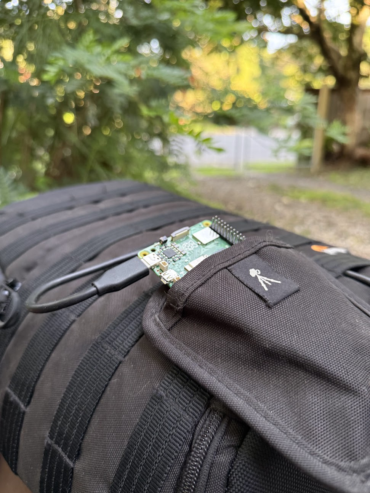

# Outbush AI

**out bush**

*/ˌaʊt ˈbʊʃ/*

In Australia, "out bush" means heading into remote wilderness, countryside, or bushland. It carries the spirit of leaving civilisation, living rough, or simply spending time reconnecting with nature and the land.

## The Idea

Australia is massive. Mobile phone services reach most people where they live, but many regional and remote areas still have no or poor data reception. That matters when you are bushwalking, camping, driving tracks, or walking beaches beyond reliable coverage.

Disconnecting and enjoying nature is fantastic until it isn't. The meme says "everything in Australia is trying to kill you"; that is overstated, but understanding risks from snakes, spiders, marine stingers, stinging trees, crocodile country, heat, storms, and even platypus spurs is central to being safe out bush.

My Mum works for the National Parks service, so when I came across a snake, odd insect, strange plant, or unfamiliar bird, I would take a photo and send it to her for identification after the hike.

## The Solution

Small open-source AI models change this process. I can bring a low-powered device like a Raspberry Pi with local language, image, and retrieval models that contain relevant Australian field information and important survival knowledge. A phone connects to the Pi's local Wi-Fi and asks questions or checks images without an internet connection.

When activated, the Raspberry Pi hosts Outbush AI locally. The app keeps deterministic safety guardrails available even when model files are missing, then adds local llama.cpp text answers, SmolVLM2 photo triage, and a field-tuned dangerous-species classifier when those models are installed.

This hack is built for Australian wilderness context, but the pattern can be adapted for any region, climate, and risk profile.

## The Application

We were walking our dog on a quiet beach with no mobile reception and spotted something slithering along the sand. It was a snake I had never seen before. When I took a photo and processed it with Outbush AI, the app identified it as a yellow-bellied sea snake candidate and noted it as highly venomous. We stayed clear, continued our walk, and reported the animal to a wildlife rescue organisation.

Live hackathon Space: https://huggingface.co/spaces/build-small-hackathon/outbush-ai

## What It Does

- Phone-friendly Gradio/FastAPI app for offline Australian field support.
- SQLite FTS5 RAG pack for first aid, dangerous animals, plants, weather, hiking, rainforest, coast, heat, and survival advice.
- Deterministic guardrails for snake bite, funnel-web and redback spider bites, marine stingers, mushrooms, poisoning, heat, exposure, weather, and emergency orientation.
- Optional local llama.cpp text model via `LLAMA_CPP_BASE_URL`.
- Optional SmolVLM2 GGUF photo triage through `llama-mtmd-cli`.
- Field-tuned dangerous-species image classifier trained from licensed iNaturalist examples and packaged for Hugging Face Space and Raspberry Pi use.

## Run Locally

```bash
python3 -m venv .venv
. .venv/bin/activate
python -m pip install -r requirements.txt
python scripts/build_knowledge_db.py
python app.py
```

Open `http://127.0.0.1:7860`.

## llama.cpp Runtime Hook

If a local llama.cpp server is available, start it separately and set:

```bash
export LLAMA_CPP_BASE_URL=http://127.0.0.1:8080
export OUTBUSH_USE_LLAMA=1
```

The app keeps deterministic safety fallbacks so emergency, mushroom, poisoning, and weather guidance does not depend on model availability.

## Offline Vision Runtime

Photo triage can use a local multimodal GGUF through llama.cpp `llama-mtmd-cli`.

- Model repo: `ggml-org/SmolVLM2-2.2B-Instruct-GGUF`
- Main model: `SmolVLM2-2.2B-Instruct-Q4_K_M.gguf`
- Projector: `mmproj-SmolVLM2-2.2B-Instruct-Q8_0.gguf`

Install on the Pi:

```bash
bash scripts/install_vision_model_pi.sh
sudo REPO_DIR=/home/vanveluwen/outbush-ai bash scripts/install_pi_services.sh
sudo systemctl restart outbush-ai
```

## Field-Tuned Dangerous-Species Classifier

The Modal training job collects licensed image examples for Australian hazards such as yellow-bellied sea snakes, red-bellied black snakes, eastern and western brown snakes, tiger snakes, taipans, funnel-web spiders, redback spiders, blue-ringed octopuses, stonefish, box jellyfish, crocodiles, and stinging trees.

```bash
. .venv/bin/activate
modal run modal_jobs/outbush_species_finetune.py
hf download build-small-hackathon/outbush-dangerous-species-classifier \
  outbush_dangerous_species_classifier.json \
  --type model \
  --local-dir models
```

The packaged JSON classifier runs with Pillow only, so it works in the Space and on the Pi without heavy Python ML dependencies.

## Tests

```bash
python scripts/build_knowledge_db.py
python -m unittest discover -s tests
python scripts/pi_smoke_test.py http://127.0.0.1:7860
```

## Pi Target

- SSID: `Outbush-AI`
- Local URL: `http://outbush.local`
- Services: llama.cpp, Outbush Gradio app, hotspot, mDNS
- Runtime: no cloud APIs after setup
- Text model path used in the Pi smoke build: `Qwen/Qwen2.5-0.5B-Instruct-GGUF`, file `qwen2.5-0.5b-instruct-q4_k_m.gguf`

## Publish To Hugging Face

After logging in with `hf auth login`, publish the Space mirror:

```bash
bash scripts/hf_publish_space.sh
```
