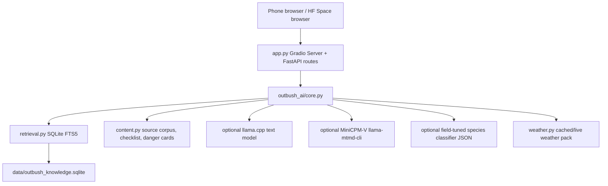

# Architecture

Outbush AI is intentionally compact.

## Request Flow

- `/api/chat` searches the local knowledge pack, applies risk banners, and asks llama.cpp to synthesize the answer. If the text model is unavailable, it says so instead of emitting a deterministic chat answer.
- `/api/photo` performs local pixel analysis, optional field-tuned species classification, optional MiniCPM-V classification, then applies conservative care notes.
- `/api/firstaid` searches the local RAG pack for a topic and returns first aid steps plus do-not guidance.
- `/api/encyclopedia` exposes direct local RAG search.
- `/api/encyclopedia/random` returns a random local knowledge item for discovery mode.
- `/api/weather` separates broad climate/profile guidance from cached or live weather pack data; `/api/weather-locations` serves the location typeahead catalogue.
- `/api/health` reports whether SQLite, llama.cpp/Nemotron, MiniCPM-V, and the species classifier are active; on Spaces it also exposes text-model setup progress.

## Data Flow

`outbush_ai/content.py` plus `outbush_ai/expanded_content.py` are the source of truth for RAG items. Run `python scripts/build_knowledge_db.py` after editing them. Tests expect the packaged SQLite database to be present, FTS-enabled, and in the 325-650 item range.

The dangerous-species image classifier is trained by `modal_jobs/outbush_species_finetune.py`. It uploads artifacts to Hugging Face and the app can run from the checked-in JSON model at `models/outbush_dangerous_species_classifier.json`.

## Runtime Philosophy

The model paths are additive but Ask mode is model-first. llama.cpp/Nemotron should provide the prose answer, while deterministic code supplies risk banners, safety footers, source selection, photo guardrails, first-aid structures, and weather/location plumbing. Space startup warms both the text runtime and MiniCPM runtime in background threads so health can be checked while large model files are still downloading.
